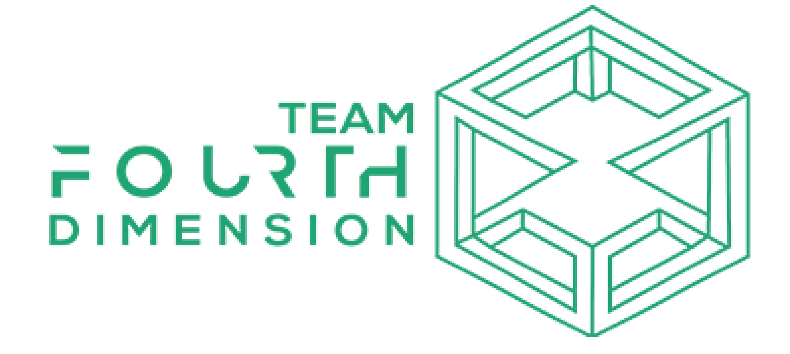

<!-- PROJECT SHIELDS -->
<!--
*** I'm using markdown "reference style" links for readability.
*** Reference links are enclosed in brackets [ ] instead of parentheses ( ).
*** See the bottom of this document for the declaration of the reference variables
*** for contributors-url, forks-url, etc. This is an optional, concise syntax you may use.
*** https://www.markdownguide.org/basic-syntax/#reference-style-links
-->
[![Contributors][contributors-shield]][contributors-url]
[![Forks][forks-shield]][forks-url]
[![Stargazers][stars-shield]][stars-url]
[![Issues][issues-shield]][issues-url]
[![MIT License][license-shield]][license-url]
[![LinkedIn][linkedin-shield]][linkedin-url]

<!-- PROJECT LOGO -->
<br />
<p align="center">
  <a href="https://github.com/github_username/repo_name">
    
  </a>

  <h3 align="center">WeCare4U</h3>

  <p align="center">
    Period-Tracking WebApp
    <br />
    <a href="https://github.com/Avinash-Singh-G/WeCare4u"><strong>Explore the docs »</strong></a>
    <br />
    <br />
    <a href="https://github.com/Avinash-Singh-G/WeCare4u">View Demo</a>
    ·
    <a href="https://github.com/Avinash-Singh-G/WeCare4u/issues">Report Bug</a>
    ·
    <a href="https://github.com/Avinash-Singh-G/WeCare4u/issues">Request Feature</a>
  </p>
</p>


<!-- TABLE OF CONTENTS -->
<details open="open">
  <summary><h2 style="display: inline-block">Table of Contents</h2></summary>
  <ol>
    <li>
      <a href="#about-the-project">About The Project</a>
      <ul>
        <li><a href="#built-with">Built With</a></li>
      </ul>
    </li>
    <li>
      <a href="#getting-started">Getting Started</a>
      <ul>
        <li><a href="#prerequisites">Prerequisites</a></li>
        <li><a href="#installation">Installation</a></li>
      </ul>
    </li>
    <li><a href="#usage">Usage</a></li>
    <li><a href="#roadmap">Roadmap</a></li>
    <li><a href="#contributing">Contributing</a></li>
    <li><a href="#license">License</a></li>
    <li><a href="#contact">Contact</a></li>
    <li><a href="#acknowledgements">Acknowledgements</a></li>
  </ol>
</details>


<!-- ABOUT THE PROJECT -->
## About The Project

Periods usually arrive every month in a woman’s life. But we all are so busy in our mundane work that we tend to forget our period dates. Moreover, most of the women have such an inconsistent cycle that it is worthless for them to remember their previous dates. Also due to lack of awareness and hesitation in the society many women don’t know the reason and what exactly one should do during menstruation.


### Built With

- <code></code> HTML
- <code></code> CSS
- <code></code> Python
- <code></code> GIT
- <code></code> Github
- <code></code> Flask


<!-- GETTING STARTED -->
## Getting Started

To get a local copy up and running follow these simple steps.

### Prerequisites

Things you need to use the software and how to install them.
* Colab Notebook
  ```sh
  https://colab.research.google.com/drive/12eNsO0x-kemdWWZ0CmsdrFVsmg4ekxrZ#scrollTo=f23iedCm3bII
  ```

### Installation

1. Clone the repo
   ```sh
   git clone https://github.com/Avinash-Singh-G/WeCare4u.git
   ```
2. Flask
   ```sh
   cd Flask  
   pip install -r requirements  
   python  flaskapp.py
   ```
3. Streamlit
   ```sh
   cd Streamlit 
   pip install -r requirements 
   streamlit run app.py
   ```

## Deployment 

The project has been deployed as a 2-part project.
The Machine Learning Model is made using Streamlit and was deployed using Heroku. The main frontend for the website was made by using Flask as a backend and Jinga as its templating engine.
This also being deployed on Heroku, directly from the Github repositories.


### Use MOZILLA FIREFOX for optimised results


<!-- USAGE EXAMPLES -->
## Usage

This period tracking webapp will help in recording the changes in her cycle which might be the sign of a potentially dangerous health issue. Furthermore, it will also help her to know more about her body, mood swings and to avoid sudden and severe period cramps. We also provide the estimated day of ovulation so that a woman could know when we can conceive. 
Most of the pre-existing websites or apps lack accuracy so women generally get more confused about their dates and moreover these apps take into account very few features to determine the dates. We take more data into account to provide much more accurate and efficient results. Our other features include specialized **WeCare forums** where women can freely and anonymously discuss their queries. We also have our 24x7 **WeCare chatbot** where women can get answers to their queries anytime.


<!-- ROADMAP -->
## Roadmap

See the [open issues](https://github.com/Avinash-Singh-G/WeCare4u/issues) for a list of proposed features (and known issues).


<!-- CONTRIBUTING -->
## Contributing

Contributions are what make the open source community such an amazing place to be learn, inspire, and create. Any contributions you make are **greatly appreciated**.

1. Fork the Project
2. Create your Feature Branch (`git checkout -b feature/AmazingFeature`)
3. Commit your Changes (`git commit -m 'Add some AmazingFeature'`)
4. Push to the Branch (`git push origin feature/AmazingFeature`)
5. Open a Pull Request


<!-- LICENSE -->
## License

Distributed under the MIT License. See `LICENSE` for more information.


<!-- CONTACT -->
## Contact

Avinash Singh - [@Aavinashh__](https://twitter.com/Aavinashh__) - avinashsingh2161@gmail.com

Project Link: [https://github.com/Avinash-Singh-G/WeCare4u](https://github.com/Avinash-Singh-G/WeCare4u)


<!-- ACKNOWLEDGEMENTS -->
## Acknowledgements

* [Bhavya Goel](https://github.com/bhavyagoel)
* [Nimesh Johari](https://github.com/NimeshJohari02)
* [Aman Sharma](https://github.com/arcAman07)
* [Nikita Bisht](https://github.com/NikitaBisht2605)
* [Tanmay Vyas](https://github.com/Tanmay000009)

<p align="center">
	With :heart: by <a href="https://ietvit.tech/" target="_blank">Team Fourth Dimension, IET-VIT</a>
</p>


<!-- MARKDOWN LINKS & IMAGES -->
<!-- https://www.markdownguide.org/basic-syntax/#reference-style-links -->
[contributors-shield]: https://img.shields.io/github/contributors/Avinash-Singh-G/WeCare4u.svg?style=for-the-badge
[contributors-url]: https://github.com/Avinash-Singh-G/WeCare4u/graphs/contributors
[forks-shield]: https://img.shields.io/github/forks/Avinash-Singh-G/WeCare4u.svg?style=for-the-badge
[forks-url]: https://github.com/Avinash-Singh-G/WeCare4u/network/members
[stars-shield]: https://img.shields.io/github/stars/Avinash-Singh-G/WeCare4u.svg?style=for-the-badge
[stars-url]: https://github.com/Avinash-Singh-G/WeCare4ustargazers
[issues-shield]: https://img.shields.io/github/issues/Avinash-Singh-G/WeCare4u.svg?style=for-the-badge
[issues-url]: https://github.com/Avinash-Singh-G/WeCare4u/issues
[license-shield]: https://img.shields.io/github/license/Avinash-Singh-G/WeCare4u.svg?style=for-the-badge
[license-url]: https://github.com/Avinash-Singh-G/WeCare4u/blob/master/readme/LICENSE.txt
[linkedin-shield]: https://img.shields.io/badge/-LinkedIn-black.svg?style=for-the-badge&logo=linkedin&colorB=555
[linkedin-url]: https://linkedin.com/in/avinash-singh-b992ba1ba
